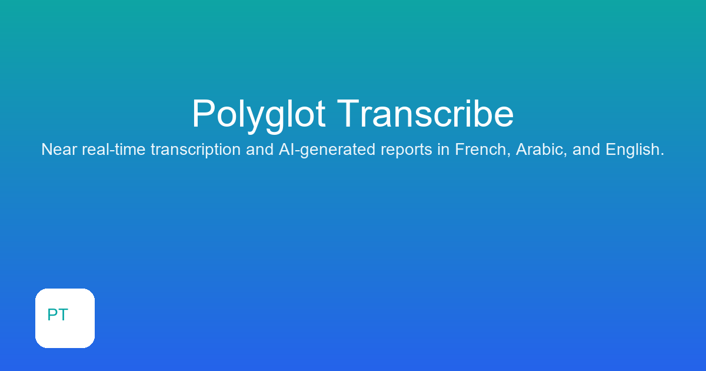

# Polyglot Transcribe

Turn spoken conversations into text, and text into structured reports — in French, Arabic, and English.

**[Live demo →](#)** *(add your Vercel URL here once deployed)*

---

## What this project does

Polyglot Transcribe is a web app that listens to speech (live, in short chunks, or from an
uploaded audio file) and turns it into text in real time. Once a transcript exists, one click
generates a clean, structured written report from it — a meeting summary, a consultation note,
whatever the situation calls for — using an AI language model. The report's instructions
(the "prompt") come with a sensible default, but can be fully rewritten by the user for their
own use case.

**Who this is for:** anyone who needs a written record of a spoken conversation without typing
it themselves — think consultations, interviews, meetings, or lectures — across three languages,
without switching tools.

**Core capabilities:**
- 🎙️ Near real-time transcription while speaking (captured in short audio chunks)
- 📁 Upload an existing audio file for one-shot transcription
- 🌍 French, Arabic, and English support
- 📋 Copy transcript to clipboard, or export it as a text file
- 🤖 One-click AI-generated report from the transcript, with an editable prompt
- 🔒 Built-in file size and usage limits to keep the demo sustainable

This project was built as a hands-on exploration of speech-to-text pipelines and applied LLM
tooling — end to end, from audio capture in the browser to a deployed, publicly usable product.

---

## Screenshots

A generated share/social preview image and a static snapshot of the built home page are included in the repo for reproducibility and README use.

**Share preview**



**Static home page snapshot**

A static HTML snapshot of the production-built home page is included at [scripts/snapshot_home.html](scripts/snapshot_home.html). Open that file in your browser to see the exact rendered markup produced by the production build (useful for capturing screenshots or verifying the static output).

---

## Examples

An example preprocessed audio file is included in the repo for demo and testing: [frontend/public/examples/086_preprocessed.wav](frontend/public/examples/086_preprocessed.wav). When the app is deployed the same file is served from /examples/086_preprocessed.wav (for example: https://your-site.example/examples/086_preprocessed.wav). Use this file to try the upload flow or to audition the preprocessing/denoising pipeline.

Admin-only: publishing examples from the site

The app includes an optional "Publish example" feature that lets an admin preprocess and save an uploaded audio file into the repo's public examples folder (frontend/public/examples). This is protected by a frontend toggle that is enabled when you set the environment variable NEXT_PUBLIC_ENABLE_PUBLISH=true for your frontend deployment or local dev environment. When enabled, the upload card shows a small "Publish example" control where you can provide an optional filename and publish the currently-selected file. The server validates the processed audio before saving to avoid corrupted files.

To enable publishing locally (recommended for maintainers):

  # in frontend/.env.local
  NEXT_PUBLIC_ENABLE_PUBLISH=true

Then run the frontend dev server and open the app. After selecting a file, enter an optional filename and click "Publish example". The site will call the backend POST /preprocess/save endpoint which preprocesses, validates, and saves the cleaned WAV into frontend/public/examples. The saved file is then available at /examples/<filename> on the deployed frontend.

Auto-commit and push to GitHub (optional)

If you would like the backend to automatically commit saved examples into the repository and push them to origin/main, enable the backend environment variable AUTO_COMMIT_EXAMPLES=true on the host where the backend runs. The backend will then attempt to run `git add`, `git commit`, and `git push origin main` after saving a validated example. Note:

- This requires the backend host to have git installed and configured with appropriate credentials (SSH key or HTTPS token) that allow pushing to the repository — the server cannot set these for you.
- Auto-commit is best used in a trusted, maintainer-controlled environment. If git operations fail the API will return a helpful `git` field explaining the failure; nothing destructive is performed.

To enable auto-commit on the backend host (example for PowerShell / Render environment variables):

  # set as an environment variable for the backend process
  $env:AUTO_COMMIT_EXAMPLES = 'true'

Restart the backend after setting the env var. The API response from POST /preprocess/save includes a `git` object with { attempted, ok, message } describing the result of the auto-commit attempt.

---

Project description shown on GitHub: "Polyglot Transcribe — near real-time multilingual speech-to-text with AI-generated structured reports (French, Arabic, English)."

To set this on GitHub (locally while authenticated) run this command:

  gh repo edit --description "Polyglot Transcribe — near real-time multilingual speech-to-text with AI-generated structured reports (French, Arabic, English)." --homepage "https://github.com/omarja12/polyglot-transcribe"

Or edit the repository description directly in the GitHub web UI (top of the repo page). I can't set the repo metadata from this environment without your authentication, so use the command above on your machine if you want to apply it immediately.

  gh repo edit --description "Polyglot Transcribe — near real-time multilingual speech-to-text and AI-generated reports (French, Arabic, English)." --homepage "https://github.com/omarja12/polyglot-transcribe"

I can't change the GitHub repo metadata (description/homepage) from this environment without authentication, but the command above will do it if you run it on your machine while authenticated with gh. If you want, paste or upload a short one-line description and I can include it as the recommended repo description in the README as well.

---

## Tech stack

| Layer | Technology | Why |
|---|---|---|
| Frontend | Next.js (React, TypeScript) | Modern React framework, deploys natively on Vercel with zero config |
| Backend | FastAPI (Python) | Lightweight, async-friendly API layer, easy to reason about and extend |
| Speech-to-text | [Whisper large-v3](https://github.com/openai/whisper) via [Groq](https://groq.com) | OpenAI's most accurate open Whisper model, served by Groq's inference hardware for very low latency — the speed that makes near-real-time chunked transcription feasible without hosting a GPU myself |
| Report generation | Configurable via GROQ_REPORT_MODEL (defaults to qwen/qwen3.6-27b on this repo) | Model is selected via environment variable `GROQ_REPORT_MODEL`. Set `GROQ_REPORT_MODEL` to the desired model id after confirming access on your Groq account. |
| Hosting | Vercel (frontend) + Render (backend) | Both offer genuinely free tiers suitable for a public demo |

**Why Groq specifically:** Whisper is not a streaming model — it transcribes a finished audio
segment, not a live audio stream. To approximate real-time transcription, this app records short
(~5 second) chunks continuously and sends each one for transcription as soon as it's captured.
That only feels responsive if each chunk comes back fast — Groq's inference speed is what makes
that loop usable instead of laggy.

---

## Architecture

```
┌─────────────────┐        audio chunks / file        ┌──────────────────┐
│                  │ ────────────────────────────────▶ │                  │
│  Next.js frontend │                                   │  FastAPI backend │
│  (Vercel)         │ ◀──────────────────────────────── │  (Render)        │
│                  │        transcript / report          │                  │
└─────────────────┘                                     └────────┬─────────┘
                                                                   │
                                                          ┌────────▼─────────┐
                                                          │   Groq API        │
                                                          │  - Whisper large-v3
                                                          │  - Report model configurable via GROQ_REPORT_MODEL
                                                          └───────────────────┘
```

**Live mode:** the browser records the microphone in ~5 second chunks via `MediaRecorder`, sends
each chunk to `/transcribe/chunk`, and appends the returned text to a running transcript.

**Upload mode:** a full audio file is sent to `/transcribe/file` and transcribed in one call.

**Report generation:** the accumulated transcript (from either mode) is sent to `/report` along
with a prompt — a sensible default, or a fully custom one the user writes — and the backend
returns a structured report from the LLM.

---

## Project structure

```
polyglot-transcribe/
├── backend/                 FastAPI app
│   ├── main.py               all API routes: transcription, report, usage
│   ├── requirements.txt
│   ├── .env.example
│   └── render.yaml           Render deployment blueprint
├── frontend/                 Next.js app
│   ├── app/
│   │   ├── page.tsx          main UI: recorder, upload, transcript, report
│   │   ├── layout.tsx
│   │   └── globals.css
│   ├── lib/
│   │   ├── api.ts            typed fetch wrappers for the backend
│   │   └── types.ts
│   ├── package.json
│   └── .env.local.example
└── README.md
```

---

## Running locally

Quick checklist (Windows PowerShell)

```powershell
# Backend
cd backend
python -m venv .venv
# Install dependencies using the venv python (no need to "activate")
.venv\Scripts\python -m pip install --upgrade pip
.venv\Scripts\python -m pip install -r requirements.txt
copy .env.example .env
# Edit backend\.env to set GROQ_API_KEY and optional GROQ_REPORT_MODEL
.venv\Scripts\python -m uvicorn main:app --reload --port 8000

# Frontend (new terminal)
cd frontend
npm install
copy .env.local.example .env.local
npm run dev
# Open http://localhost:3000
```

Quick checklist (macOS / Linux)

```bash
# Backend
cd backend
python -m venv .venv
. .venv/bin/activate
pip install -r requirements.txt
cp .env.example .env
uvicorn main:app --reload --port 8000

# Frontend (new terminal)
cd frontend
npm install
cp .env.local.example .env.local
npm run dev
# Open http://localhost:3000
```

Get a free Groq API key at [console.groq.com/keys](https://console.groq.com/keys).

About / How it works

Polyglot Transcribe converts short audio snippets or uploaded recordings into clean
meeting or consultation reports. The app transcribes audio (Whisper models) and then
generates a structured report (summary, key points, decisions, follow-ups) using a
configurable LLM on Groq. For portfolio demos, the report model is configurable via
environment variables so the demo runs with your available account models.

For running locally, set GROQ_API_KEY in backend/.env and (optionally) GROQ_REPORT_MODEL
if you'd like to test a specific model that your Groq account can access.

---

## Deployment

### Backend → Render

1. Push this repo to GitHub.
2. On [Render](https://render.com), create a new **Web Service** from the repo, root directory
   `backend` (or let it pick up `backend/render.yaml` automatically).
3. Add environment variables: `GROQ_API_KEY` and `ALLOWED_ORIGINS` (your Vercel domain, once you
   have it — comma-separated if you need more than one).
4. Deploy. Render's free tier spins the service down after 15 minutes of inactivity, so the
   first request after idle time takes ~30–60 seconds to wake up — the frontend shows this as
   normal loading state, not an error.

### Frontend → Vercel

1. On [Vercel](https://vercel.com), import the same repo, set the root directory to `frontend`.
2. Add environment variable `NEXT_PUBLIC_API_URL` pointing to your Render backend URL.
3. Deploy.

Both platforms offer free tiers sufficient for a public portfolio demo — no payment required.

---

## Limits (by design)

- **Upload size:** capped at 50 MB per file.
- **Usage:** capped at 60 minutes of processed audio per client (tracked in-memory on the
  backend, reset on server restart). This exists to keep the public demo's free-tier API usage
  sustainable, not as a product feature — swap for persistent storage (e.g. a database) if this
  ever needs to survive server restarts.

---

## Possible next steps

- Persist usage tracking in a real database instead of in-memory state
- Speaker diarization (distinguishing between multiple speakers in one recording)
- Export report as PDF/Word in addition to plain text
- Streaming report generation (token-by-token) instead of waiting for the full response
